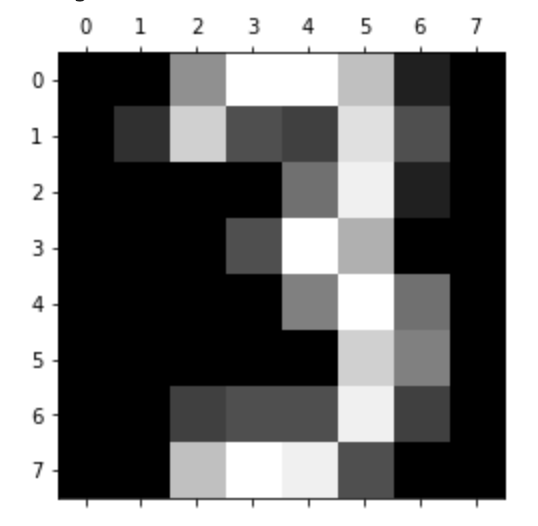

ModelDB: An open-source system for Machine Learning model versioning, metadata, and experiment management.

Here I show two examples from [Verta.ai documentation](https://docs.verta.ai/en/master/examples/examples.html) -

* Example1.ipynb: Tensorflow's Keras API for building neural networks
* Example2.ipynb: XGboost model development and cross-validation

Both examples shows the digit classification model development and logging of artifacts using ModelDB.

Both examples show:

* verta's Python client logging observations and artifacts during validation
* verta's Python client retrieving the loss/accuracy plot and the trained model from the validation process

You can setup the environment by following this [repo](https://github.com/VertaAI/modeldb).

